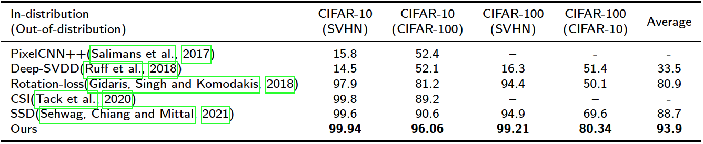

## Self-supervised Out-of-distribution Detection using Vision Transformer and Contrastive Learning

This repo use some code from [MoCo-v3](https://github.com/facebookresearch/moco-v3) and the ood score calculation using code from [OOD Detection Metrics](https://github.com/tayden/ood-metrics)

Our self-superivised OOD detector achieves state-of-art performance.


### Usage: Preparation
The code has been tested with CUDA 11.7, PyTorch 1.11.0 and timm 0.6.5. 

### Training 
The model is trained with 1-node (2-GPU), batch 64. 

```
CUDA_VISIBLE_DEVICES=2,3 python train.py -a vit_base --optimizer=adamw --lr=1e-6 --weight-decay=1e-1 --epochs=50 --warmup-epochs=0 --moco-m-cos --moco-t=.5 --pretrained --dist-url 'tcp://localhost:10001' --multiprocessing-distributed --world-size 1 --rank 0 --data-set cifar10 --moco-dim=768 --ckpt [path to checkpoint folder] --batch-size 64
```
#### Notes:
1. `-a` is the architecture, which can be one of the following:
  ```
  deit_small=deit_small_patch16_224, vit_small=vit_small_patch16_224,
  vit_base=vit_base_patch16_224, vit_base_in21k=vit_base_patch16_224_in21k,
  swin_base=swin_base_patch4_window7_224, swin_base_in21k=swin_base_patch4_window7_224_in22k,
  resnet50=resnetv2_50
  ```


### Testing
We evaluate the model in 1 GPU with 256 batch.
The in-distribution dataset is `--data-set` and out-of-distribution datsets in ['cifar10', 'cifar100', 'svhn']

```
CUDA_VISIBLE_DEVICES=0 python test_with_metrics.py -a vit_base --gpu 0 --data-set cifar10 --ckpt [path to checkpoint folder] --moco-dim=768 --mode unsup --clusters 1 --batch-size 256
```

#### Notes:
1. `--feature-type` has three choices `['ensemble', 'encoder','predictor']`, and default value is `ensemble`. The feature type `ensemble` only fit `--moco-dim=768`.
  If you need another `--moco-dim`, you should change the `--feature-type` to `encoder` or `predictor`.
1. `--data-set` is the ID dataset.
1. `--ckpt` is the folder storing the checkpoints.
1. `--moco-dim` shoud be the same as training setting.
1. `--clusters` is the number of clusters
1. `--plot_debug` will save the figures of distributions and features to `--ckpt`